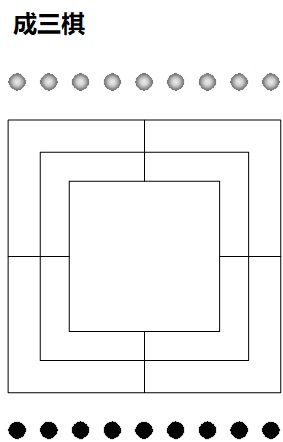
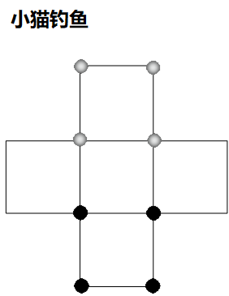
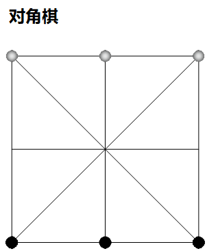
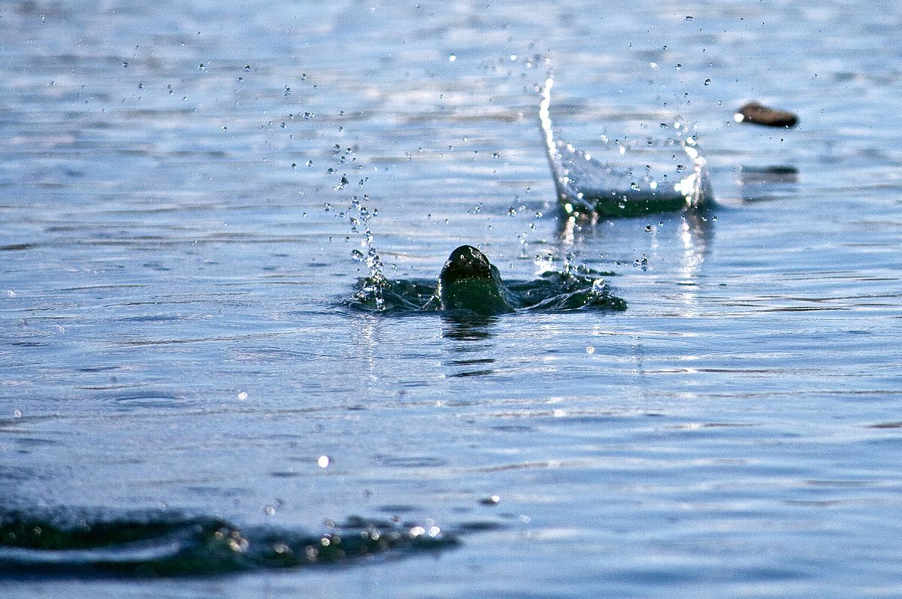
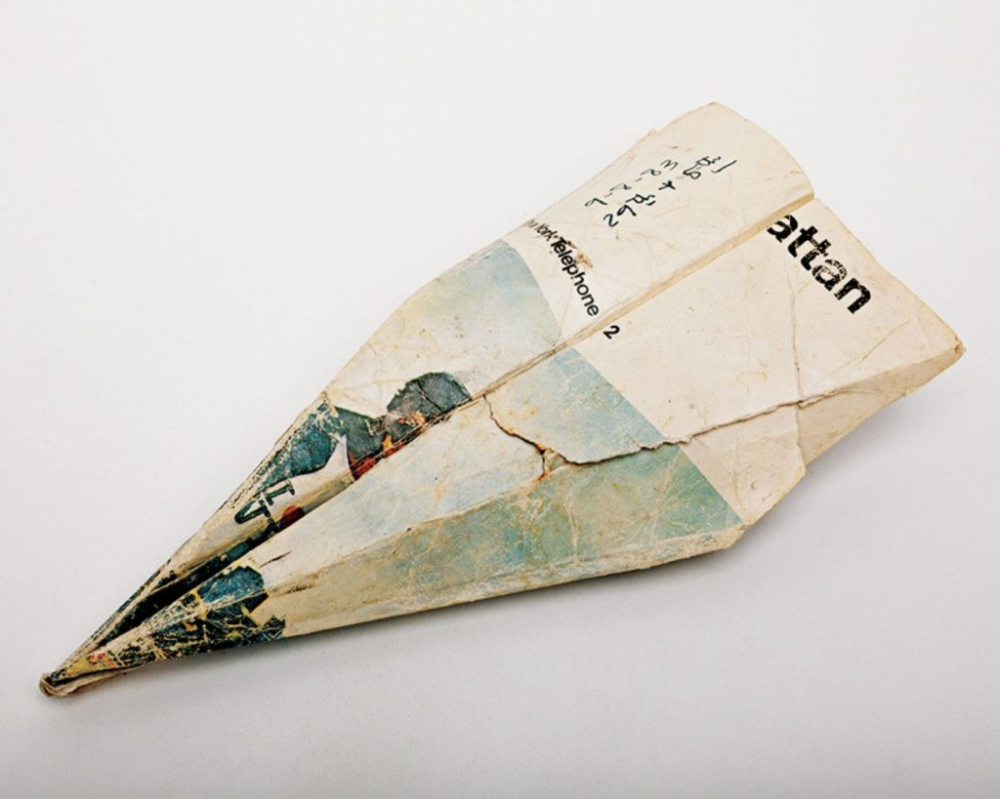

# What is the Monet? 介紹

The monet is a book to introduce traditional games all over the world. You maybe see what you have played, or your parents have.
I believe that traditional games make relax and happy us. If you are insteresting, welcome to share your idea and **pull requests** : )

My E-mail: bearsugar(you know)foxmail(dot)com

## 1. Stone Game 石之遊戲

1. Best-Three 成三棋

   

2. Cat-Chase-Fish 小貓釣魚

   

3. Corner-Line 對角棋

   

## 2. Water Game 水之遊戲

1. Stone-Skipping 打水漂

   

## 3. Paper Game 紙之遊戲

1. Paper Airplanes 折紙飛機

   https://francishodgson.com/2021/02/03/leaving-no-tract-behind

   

# Contributors 貢獻者

* [guguant](https://github.com/Guguant)
